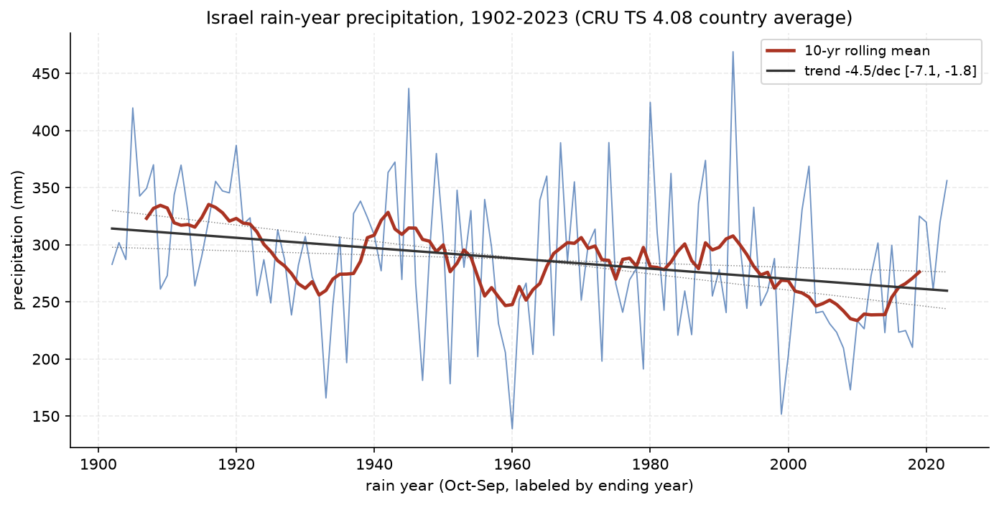
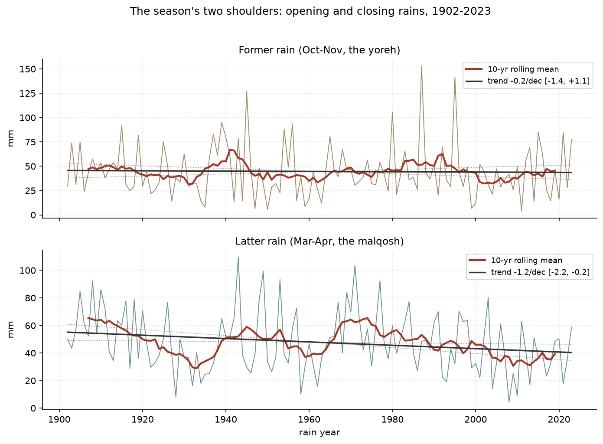
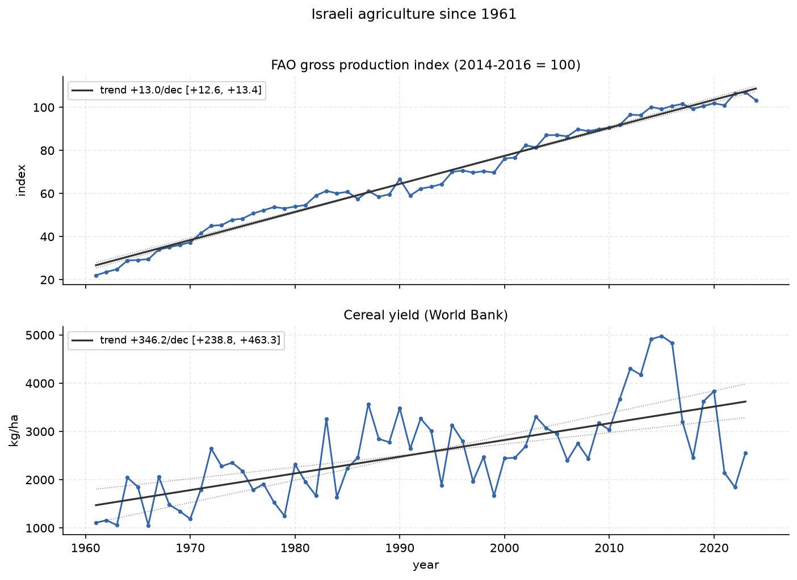
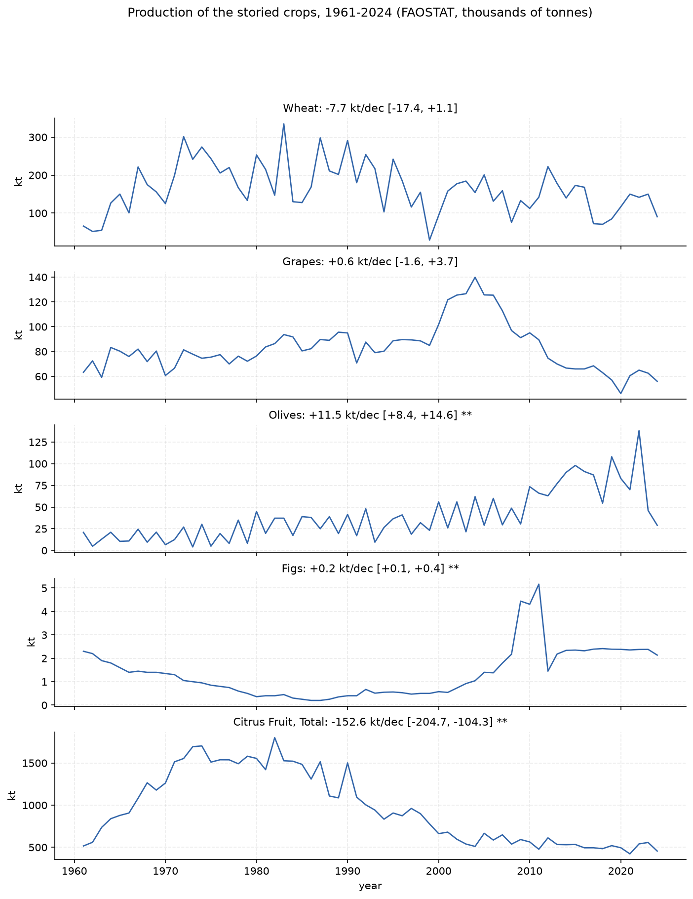
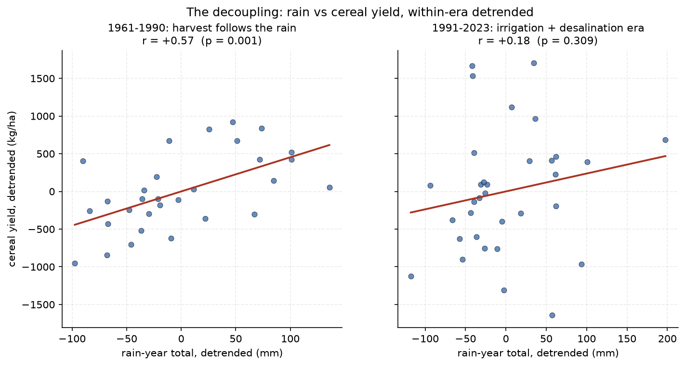

# israel-rain-agriculture

Yearly monitoring of rainfall on the land of Israel and the output of its
agriculture. One of the sibling repos analyzed together in the
[`correlations`](https://github.com/Biblejustin/correlations) hub.

## Why these two, together

Deuteronomy 11:13-17 binds them into one covenant package: rain "in its
season, the early rain and the later rain," so that the land yields "your
grain and your wine and your oil." Joel 2:23 speaks of the latter rain in
restoration language, and Ezekiel 36:8-11 promises a land that shoots forth
branches and yields fruit "for my people Israel, for they are soon to come
home." Whether and how the modern data lines up with that frame is exactly
what a monitor should measure rather than assert. The interpretive frame is
ours; the numbers below are reported straight, including the ones that cut
against the expected story.

## Quick findings

- **Rain is declining.** Rain-year totals (Oct-Sep) fall **-4.5 mm/decade
  [CI -7.1, -1.8] over 1902-2023** against a 287 mm mean; that is roughly
  55 mm lost in a century.
- **The loss is concentrated in the latter rain.** The Mar-Apr closing
  rains (the *malqosh*) decline **-1.2 mm/decade [CI -2.2, -0.2]
  (-2.6%/decade)**, while the Oct-Nov opening rains (the *yoreh*) are flat.
  Measured against Joel 2:23 restoration language, the latter rain has been
  shrinking, not returning; honesty requires saying so.
- **Agriculture is booming anyway.** FAO's gross production index rises
  **+19.2%/decade (CI excludes 0)**: the land produces roughly **4.7x its
  1961 output**. Cereal yield per hectare is up +13.6%/decade.
- **The storied crops mostly bloom.** Olives **+29%/decade** and figs
  **+17%/decade** (both significant); grapes flat in tonnage (the quality
  boom is not a tonnage story); wheat flat-to-down; and citrus, the famous
  Jaffa orange, has **collapsed -16%/decade** as water costs and
  urbanization took the orchards.
- **The harvest has been decoupled from the sky.** Before 1990, detrended
  cereal yield tracked detrended rainfall at **r = +0.57 (p = 0.001)**: dry
  year, thin harvest, as in every century before. Since 1991, with drip
  irrigation everywhere and desalination at scale (Ashkelon 2005, Sorek
  2013), the correlation drops to **r = +0.18 (not significant)**. The
  National Water Carrier, the drip emitter, and the desal plant stand
  between the rain and the bread.

The blossoming-land half of the Ezekiel 36 frame is measurably true, and it
is true *by irrigation engineering during declining rainfall*, which is a
more interesting fact than either a bare miracle claim or a bare debunk.
The covenant text itself ties rain to the land's response to its people;
the modern record shows a people who built around the rain. We report both
lines and let the reader weigh them.

## Figures

### Rain years



**In plain English:** Each point of the blue line is one rain year (October
through September, labeled by the year it ends). The red line smooths ten
years at a time so the eye can follow the drift. The dark line is the
long-run trend with its uncertainty band: tilted downward, and the tilt is
statistically real. Israel's rain arrives almost entirely October-May;
totals bounce hard year to year (139 mm in 1960, 469 mm in 1992), which is
why the smoothed line matters more than any single spike.

### Former and latter rain



**In plain English:** The rainy season has two shoulders: the opening rains
of October-November that soften the ground for plowing, and the closing
rains of March-April that fill the grain. The top panel (opening rains) is
flat across 122 years. The bottom panel (closing rains) tilts down, and its
uncertainty band excludes zero: the season has been losing its finish, not
its start.

### Production



**In plain English:** Top: the UN food agency's index of everything Israeli
agriculture produces, scaled so 2014-2016 average = 100. It climbs from 22
in 1961 to over 100 today. Bottom: how much grain one hectare yields; the
same climb. Both slopes are unambiguous.

### The storied crops



**In plain English:** Five crops with long histories in the land, in
thousands of tonnes per year. Olives and figs rise strongly; grapes hold
steady in weight; wheat drifts; citrus falls off a cliff after the 1980s.
Two asterisks on a title mean the trend is statistically solid.

### The decoupling



**In plain English:** Each dot is one year, positioned by how unusual its
rain was (left-right) and how unusual its grain yield was (up-down), after
removing each era's own trend. Left panel, 1961-1990: dots slope upward;
wet years genuinely meant better harvests. Right panel, 1991-2023: the
slope collapses toward flat; the harvest no longer depends on the sky,
because the water now arrives by pipe.

## Data

| File | Source | Span |
|---|---|---|
| `data/rain_cckp_annual.csv` | World Bank CCKP, CRU TS 4.08 country series for ISR (pinned vintage) | 1901-2023 |
| `data/rain_cckp_monthly.csv` | Same, monthly resolution | 1901-2023 |
| `data/faostat_production_index.csv` | FAOSTAT bulk (Production Indices), Israel, Gross Production Index 2014-2016=100 | 1961-2024 |
| `data/faostat_crops.csv` | FAOSTAT bulk (Crops & Livestock), Israel, production tonnes: wheat, grapes, olives, figs, citrus | 1961-2024 |
| `data/wb_cereal_yield.csv` | World Bank WDI `AG.YLD.CREL.KG` | 1961-2023 |

Notes and caveats:

- CRU TS is a gridded reconstruction averaged over the country's area; it is
  the right tool for trends, not for any single farm's rain gauge. Israel's
  north-south rainfall gradient (900+ mm in the upper Galilee, <50 mm in
  Eilat) is averaged inside it.
- FAOSTAT's JSON API went auth-only in 2025; the bulk zips remain open and
  are what `fetch_data.py` uses, re-downloading only when the local copy is
  older than 90 days (they update roughly annually).
- Israel Meteorological Service daily station data (data.gov.il, homogenized
  series; Jerusalem back to 1950) is a candidate upgrade for station-level
  analysis; noted as future work.

## Reproducing

```bash
python fetch_data.py          # guarded fetch (CCKP + WDI weekly; FAOSTAT when stale)
python analyze.py             # trends + coupling table
python make_plots.py          # regenerates figures/
# or all three:
bash update.sh
```

This repo refreshes automatically each Saturday with the rest of the family
via the `correlations` repo's `weekly_update.sh`.

## Citations

- Harris, I. et al. (2020). *Version 4 of the CRU TS monthly high-resolution
  gridded multivariate climate dataset.* Scientific Data 7, 109. (via World
  Bank Climate Change Knowledge Portal)
- FAO. *FAOSTAT Production Indices and Crops & Livestock Products.* Rome.
- World Bank. *World Development Indicators*, AG.YLD.CREL.KG.
